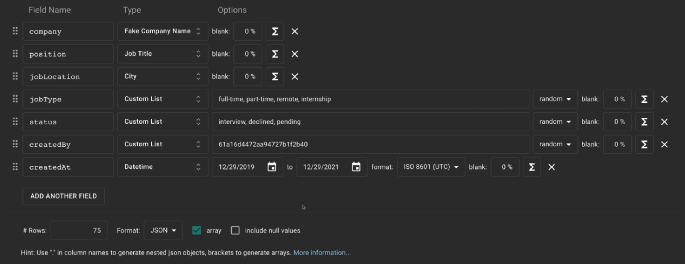
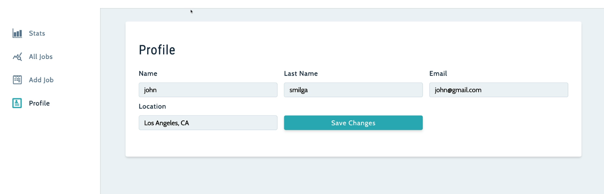

#### 因为后端使用的是 ES6 module, 所以 import 的语法是与前端不同的, 导入 module 时必须要加上 js 后缀

### Auth Controller: 

> register, login, updateUser, logout

- authRouter

  - `router.route('/register').post(register);`

  -   `router.route('/login').post(login);`

      -   register 和 login 都是从 req.body 获取传入的 name/email/password, 然后进行 database side 的比对检验, 如果有问题 throw custom error. 如果没有 error, 最后返回

      ```js
      res.json({
          token,
          user: foundUser,
          location: foundUser.location,
      });
      ```

  - `router.route('/updateUser').patch(updateUser);`

    -   对于这个 route 我们改为: `router.route("/updateUser").patch(authenticateUser, updateUser);` 代表在进入 updateUser route handler 之前必须检验 request 的 header 包含有正确的 token，否则不允许进入

    ```js
    res.status(200).json({
        token,
        user: updatedUser,
        location: updatedUser.location,
    });
    ```

    在 authRoutes.js 文件中，引入在 authController 定义的功能

    ```js
    import {
      register,
      login,
      updateUser,
      getCurrentUser,
      logout,
    } from '../controllers/authController.js';
    import authenticateUser from '../middleware/auth.js';
    import testUser from '../middleware/testUser.js';
    ```

    然后使用 router 使用这些 controllers

    ```js
    const router = express.Router();
    router.route('/register').post(apiLimiter, register);
    router.route('/login').post(apiLimiter, login);
    router.get('/logout', logout);
    
    router.route('/updateUser').patch(authenticateUser, updateUser);
    router.route('/getCurrentUser').get(authenticateUser, getCurrentUser);
    
    ```

  -   authenticateUser middleWare

      -   only the user who actually has the data can have access to view the profile and jobs page, etc, we will check the token.

      -   创建一个 middleware 叫做 authenticateUser, if the token is not valid, or it's not present, then we'll send back the error. And we will log out the user on a frontend as well.
      -   `router.route("/updateUser").patch(authenticateUser, updateUser);`

  最后在 server.js 中使用这些 router `app.use('/api/v1/auth', authRouter);`


### Jobs Controller: 

> createJob, deleteJob, getAllJobs, updateJob, showStats

-   jobsRouter
    
    `router.route("/").post(createJob).get(getAllJobs);`
    
    -   createJob 返回的是
        ```json
        {
            "job": {
                "company": "Google",
                "position": "software engineer",
                "status": "Applied",
                "jobType": "full-time",
                "jobLocation": "US",
                "createdBy": "63d99e85a980dcd927901634",
                "_id": "63dcbc212b94fe197a6bd8ee",
                "createdAt": "2023-02-03T07:47:45.542Z",
                "updatedAt": "2023-02-03T07:47:45.542Z",
                "__v": 0
            }
        }
        ```
    
    使用上面这些定义的 controllers：
    
    `router.route("/stats").get(showStats);`
    `router.route("/:id").delete(deleteJob).patch(updateJob);`
    
    
    
    最后在 server.js 中使用定义的 router `app.use('/api/v1/jobs', authenticateUser, jobsRouter);`

### User model, collection name is User

-   contains: name, email, password, lastName, location
-   对于 password, 我们不希望将他发送到 frontend, 所以添加了 select: false.
-   添加 UserSchema.pre 确保在注册或者更新用户并保存在数据库之前将 password 进行 hash
-   添加了 instance method createJWT 对 password 进行 jwt 加密
-   添加了 instance method validatePassword 对 传入的 password 以及数据库中存储的 password 进行比较，从而判断是否能够正确登录

### Job model, collection name is Job

-   contains: company, position, status, jobType, jobLocation, createdBy

### Error handling:

```js
class CustomAPIError extends Error {
    constructor(message) {
        super(message);
    }
}
```

-   And we have BadRequestError, NotFoundError extends CustomAPIError, 并且可以自己定义 error message

### How do JSON Web Tokens work?

In authentication, when the user successfully logs in using their credentials, a JSON Web Token will be returned. Since tokens are credentials, great care must be taken to prevent security issues. In general, you should not keep tokens longer than required.

You also should not store sensitive session data in browser storage due to lack of security.

Whenever the user wants to access a protected route or resource, the user agent should send the JWT, typically in the "Authorization" header using the "Bearer" schema. The content of the header should look like the following:
`Authorization: Bearer <token>`
This can be, in certain cases, a stateless authorization mechanism. The server's protected routes will check for a valid JWT in the Authorization header, and if it's present, the user will be allowed to access protected resources. If the JWT contains the necessary data, the need to query the database for certain operations may be reduced, though this may not always be the case.
? https://jwt.io/introduction

from the front, and we'll have to implement some code grab token from our state, and then we'll set up a request that will go to our server. And we will check for authorization header on the server, if that header is present, if the token is still valid. We can access and modify the resources, if not, it will throw the authorization error

> https://kb.objectrocket.com/mongo-db/how-to-add-instance-methods-with-mongoose-236

### 前端中 local storage 的用处

-   当刷新界面后，很多 value 会重新 rerender, 导致我们获得的 values 无法长时间保存。所以当用户登录或者注册成功后就直接在 local storage 中进行保存. 保存的变量就是从后端注册后获取的数据, 也就是 token, user and location. 同时还要设计一个函数, 用于用户登出后, 清除 localStorage 保存的信息

```js
const addUserToLocalStorage = ({ user, token, location }) => {
    localStorage.setItem("user", JSON.stringify(user));
    localStorage.setItem("token", token);
    localStorage.setItem("location", location);
};

const removeUserFromLocalStorage = () => {
    localStorage.removeItem("token");
    localStorage.removeItem("user");
    localStorage.removeItem("location");
};
```

-   当点击 submit button, component 内部定义的 onSubmit 启动，首先通过 state values 读取刚刚提交的 name, email, password. 然后经过第一个检查，要确定一定要的 field(email, password) 不为空。然后根据 {Email, password, name} 创建 currentUser。之后根据目前用户在 login 界面 isMember==true, 在 register 界面 isMember==false, 来决定是调用 loginUser func 还是 registerUser func. 这两个 function 并不是在 Register page 定义的，而是在最外层的 AppProvider 中定义的，并通过 context 传入 Register.js 文件. 调用这两个方法是，需要传入上面定义的 currentUser, 因为在 axios.post(backend) 时要同时把 currentUser 传到后端进行存储

### 前端数据如何传递

```js
// 1. 创建 context
const AppContext = createContext();

// 2. 创建一个 functional component, AppProvider, 用这个 component 包裹整体的 App Component, 达到数据全局传递的目的
const AppProvider = = ({ children }) => {
    // 使用 useReducer 定义复杂的 state, 在下面的方法中调用 dispatch 方法从而改变前端 data, 使得界面能够 re-render
	const [state, dispatch] = useReducer(reducer, initialState);
    /*
	......
    定义所有的在整个 application 组件中需要用到的方法
    */

	return (
        <AppContext.Provider
            value={{
                ...state,
                displayAlert,
                registerUser,
                loginUser,
                toggleSidebar,
                logoutUser,
                updateUser,
                handleJobChange,
                clearJobValues,
                createJob,
                getAllJobs,
                setEditJob,
                deleteJob,
                editJob,
                showJobStats,
                handleSearchKeyChange,
            }}
        >
            {children}
        </AppContext.Provider>
    );
}

// 3. 这步是为了在其他文件中能够更快速地访问 context data. 所以创建一个 custom hook, 作用非常简单, 在其他组件中只要调用这个 useAppContext 就可以获取上面 value 属性分享的全局数据
const useAppContext = () => {
    return useContext(AppContext);
};

// 4. 导出 AppProvider, 在 index.js 中进行使用
export { AppProvider, initialState, useAppContext };
```

index.js 中使用 AppProvider 包裹 \<App />

```
<AppProvider>
    <App />
</AppProvider>
```

### 如何获取 application 中的模拟数据

A free test data generator and API mocking tool - Mockaroo lets you create custom CSV, JSON, SQL, and Excel datasets to test and demo your software.

1. 通过这个网站获取了 100 条数据，将结果以 json 的形式导出存储在 root.
   
2. node 端获取数据

    ```js
    // populate.js;
    
    import { readFile } from "fs/promises";
    
    import dotenv from "dotenv";
    dotenv.config();
    
    import connectDB from "./db/connect.js";
    import Job from "./models/Job.js";
    
    const start = async () => {
        try {
            //  connect to our database
            await connectDB(process.env.MONGO_URL);
            //  clean out our database
            await Job.deleteMany();
            //  create the job lists
            const jsonProducts = JSON.parse(
                await readFile(
                    new URL("./mock-data.json", import.meta.url)
                )
            );
            await Job.create(jsonProducts);
            console.log("Success!!!!");
            process.exit(0);
        } catch (error) {
            console.log(error);
            process.exit(1);
        }
    };
    
    start();
    ```

### register user account 的步骤

用户在 Register 界面点击 register 按钮，调用通过 AppContext 传递的 registerUser function.
在 function 中的步骤就是
`dispatch({ type: REGISTER_USER_BEGIN })`

```js
// 向后端端口发送填入的信息
const response = await axios.post("/api/v1/auth/register", curUser);
```

如果成功, 进行另一个 dispatch 操作: `dispatch({type: REGISTER_USER_SUCCESS})`
此时，进入后端的代码
根据前端传入的 Email 寻找
`const foundUser = await User.findOne({ email });`
如果没找到，则根据 req.body 创建一个新的 user. 在这之后, use the Instance Methods with Mongoose to create json web token based on the password property
`const token = newUser.createJWT();`
最后，将相关信息发送会前端:

```js
res.status(201).json({
    user: newUser,
    token,
    location: newUser.location,
});
```

### 判断显示 register 还是 login

通过使用 isMember 进行判断

### nested route 使用

But if we take a look stats, jobs, add job, as well as the profile, which you'll notice that all of them share the same layout and the way we can set that up is using nested routes.


```js
<Route
    path="/"
    element={
        <ProtectedRoute>
            <SharedLayout />
        </ProtectedRoute>
    }
>
    {/* The routes nested inside of the outer one, it will always be relative to that path "/", 所以像<AllJobs />对应的界面就是 "/all-jobs" */}
    {/* 使用 index 的作用: once you navigate to the "/", you will actually direct to the "/stats" */}
    <Route index element={<Stats />} />
    <Route path="all-jobs" element={<AllJobs />}></Route>
    <Route path="add-job" element={<AddJob />}></Route>
    <Route path="profile" element={<Profile />}></Route>
</Route>
```

在 ProtectedRoute 中，通过全局的 context 获取 user，如果 user 是不存在的，将当前使用者踢回 "/landing" page

```js
/*
 * 一旦用户注销，我们实际上会将其踢回到主页面。此外，如果用户未登录就试图访问仪表板，系统也会执行同样的操作。让他们将返回到 "/landing"。
 * 具体的操作: If there is an user in the front end(通过context 获取), we will direct user to the stats, 如果没有, will direct them to the "/landing"
 */
function ProtectedRoute({ children }) {
    const { user } = useAppContext();
    if (!user) {
        return <Navigate to="/landing" />;
    }

    return children;
}

export default ProtectedRoute;
```
